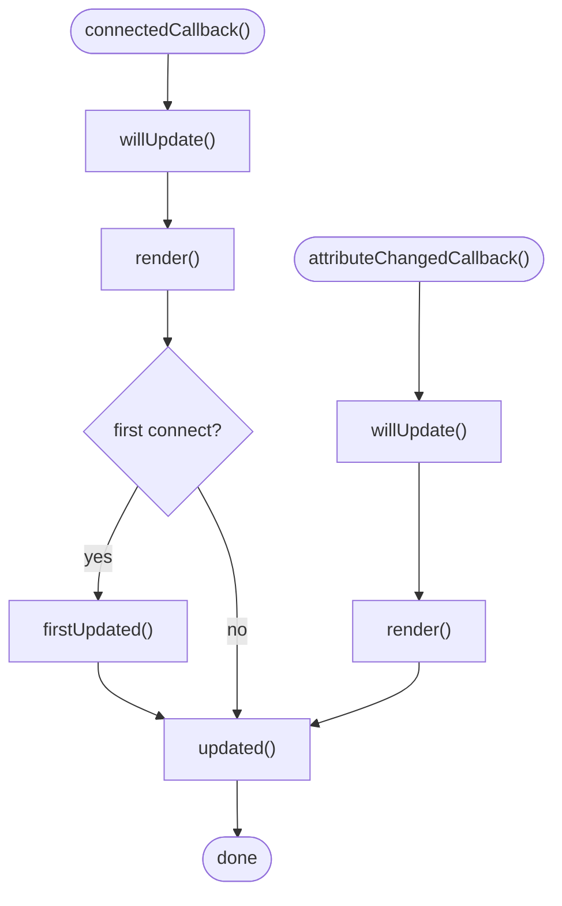

# Lifecycle

## `render()`

Returns the HTML for this component as an `html` template. Called on connect and whenever the component needs re-rendering. Omit this method entirely for [Composite Components](#) — they don’t render their own HTML.

## `willUpdate()`

Runs before every render, including the first. Override to compute derived state before the template evaluates.

## `firstUpdated()`

Runs once after the first render. `this.element` is available here. Override to run one-time setup that requires the DOM.

## `updated()`

Runs after every render, including the first. `this.element` is available here. Override to react to changes after the DOM is updated. On first connect, `firstUpdated()` runs before `updated()`.

## `connectedCallback()`

Runs when the element is added to the page. Sets up props, captures text content, renders, and wires up events.

## `disconnectedCallback()`

Runs when the element is removed from the page. Cleans up event listeners.

## `attributeChangedCallback(prop, oldValue, newValue)`

Runs when an observed attribute changes. Updates the matching JS property and triggers a re-render.
